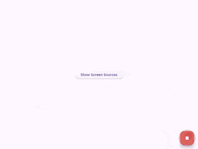

# traa-flutter

## Introduction

`traa-flutter` is a Flutter application that provides a platform for users to view and interact with the [traa](https://github.com/opentraa/traa) project. The application is designed to be user-friendly and intuitive, allowing users to easily navigate through the various features and functionalities of the project. The application is built using the Flutter framework, which allows for cross-platform development and deployment on both Android and iOS devices.

Notably, I plan to use AI to generate the majority of the code, including both the UI and the logic. This approach aims to streamline the development process and leverage the capabilities of AI to create a robust and efficient application.

## Preview

### Screen and Window Information

Below is a preview of the `enum_screen_source` feature, which was implemented in less than two hours using the [cursor](https://www.cursor.com/). This feature retrieves and categorizes information about the screens and windows in the system, displaying them in an organized manner.

This feature was generated with minimal manual intervention. I primarily relied on asking questions and providing additional details, without focusing much on the actual code being generated. The result is a fully functional feature that categorizes and displays screen and window information, achieved in a remarkably short time.